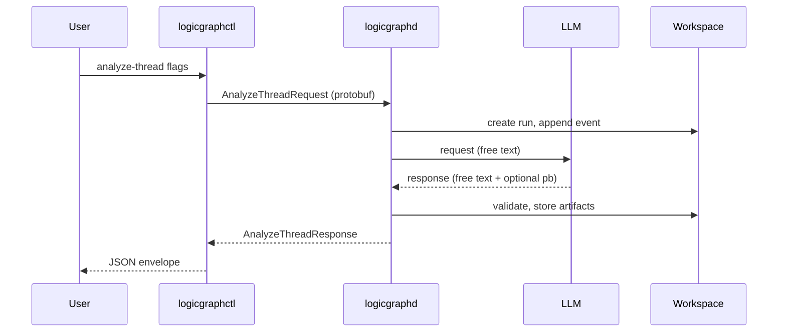

# RFC: LogicGraph Go Refactor + Monorepo Integration

- Date: 2025-12-30
- Status: Draft
- Audience: cross-functional (engineers, PMs, EMs, adjacent teams)

## 1) Narrative: what we are building and why

We are building a LogicGraph tool that uses LLMs in a ZFC‑compliant way to
decompose email/document threads into their logical components (statements,
relations, contradictions, disputes, issues, themes). The goal is to produce
machine‑readable, auditable artifacts that can be wired into our broader
workflow: “write devastating, evidence‑backed legal memos and emails to brutally
own counterparties/opponents,” without hallucinations or unverifiable claims.

We are moving LogicGraph from a Python CLI submodule into the Lawbot Hub monorepo
as a Go-first service, and we are also bringing its UI into the monorepo. This
aligns the suite around a single Go kernel (the orchestrator) and avoids
split-brain ownership between submodules and the monorepo.

LogicGraph is the system that takes a document or thread and produces a
LogicGraphResult: statement nodes, edges, contradictions, disputes, issues, and
attack-pack exports. The current Python implementation is a ZFC-compliant shell
around LLM reasoning. We want the same behavior in Go so it can plug into the
orchestrator, share common protobuf contracts, and converge with the lawbot-vault
rewrite.

The refactor keeps the current CLI contract and workspace semantics, but adds a
Go service API so the orchestrator and future unified UI can call it directly.
UI work is organized to preserve the existing app while enabling later unification.

## 1.1) Non-negotiables

- ZFC compliance: the tool is a deterministic shell; all semantic reasoning lives
  in LLM backends.
- Protobuf-first contracts: the service API is protobuf; CLI/UI are wrappers.
- Deterministic ordering, IDs, and timestamps (UTC ISO-8601 Z suffix).
- No JSON endpoints for services. JSON is allowed only for the CLI envelope.
- Preserve the authoritative spec hierarchy: docs/cli-contract.md,
  specs/cli/contract.json, schemas/*.schema.json, proto contracts, BDD tests.

## 2) Goals / Non-goals

Goals:
- Replace the Python LogicGraph CLI with a Go implementation that matches the
  current contract and tests.
- Move LogicGraph into the monorepo (no submodule) with a Go service and CLI.
- Move LogicGraph UI into the monorepo with a path toward later unification.
- Establish a stable protobuf API for LogicGraph that the orchestrator can call.
- Produce machine‑readable artifacts that upstream tools can deterministically
  consume (orchestrator, audit tools, later models).
- Maintain red-green-red parity against the Python implementation.
- Keep workspace layout and artifact formats stable (events.ndjson, runs/,
  artifacts/).

Non-goals:
- Unify all UI layers in this refactor (that is a later milestone).
- Change the LogicGraph domain model or introduce new features.
- Replace the LLM prompt/response schema in this iteration.
- Optimize performance beyond parity.

## 3) System overview

LogicGraph becomes a Go package and standalone gRPC service in the monorepo, with
a thin CLI wrapper that preserves the current JSON envelope contract. The
service exposes protobuf RPCs for core commands (analyze-thread, run-list,
run-show, gc, attack-pack). The CLI uses the service locally, and the
orchestrator can call the same service over gRPC.

UI is moved into the monorepo under a shared layout that allows today’s
LogicGraph UI to run as-is, while setting up a unified shell later.

Rationale for standalone gRPC: it maximizes testability (fixture-based golden
tests, black-box parity) and supports auditability via consistent RPC logs and
artifact capture, while still allowing the orchestrator to embed or co-locate
the service if needed.

## 4) Components and responsibilities

- logicgraphd (Go service): standalone gRPC service implementing protobuf RPCs
  and core pipeline logic.
- logicgraphctl (Go CLI): prints JSON envelopes; validates CLI contract.
- logicgraph-core (Go pkg): workspace, IDs, events log, schemas, LLM adapters.
- proto/lawbot/logicgraph/v1: service + artifacts + request/response messages.
- libs/pi: shared LLM adapter utilities (free text only).
- upstream snapshot (frozen Python reference): used for parity testing.
- ui/ (monorepo UI root): shared shell + packages.
- ui/apps/logicgraph (ported UI): existing LogicGraph UI, minimal changes.

### 4.1) UI layout proposal (monorepo)

- ui/shell/ — unified Lawbot UI shell (future, not required for parity).
- ui/apps/logicgraph/ — ported LogicGraph UI (Vite/React) with minimal changes.
- ui/apps/vault/ — existing lawbot-vault UI moved under ui/apps (later).
- ui/packages/ — shared components, design tokens, typed protobuf clients.
- ui/dev/ — shared dev tooling (lint, build, mock services).

This layout keeps current UIs runnable while enabling a staged migration into a
single shell. It avoids breaking changes during the Go port.

### 4.2) Repo layout + run commands (proposed)

Go module layout:
- logicgraph/ (Go module root)
- logicgraph/cmd/logicgraphd (gRPC service)
- logicgraph/cmd/logicgraphctl (CLI wrapper)
- logicgraph/internal/... (core logic: workspace, LLM runners, validation)

Final target after submodule removal:
- logicgraph/ (Go module root, replacing the current submodule)

Run commands:
- `go run ./logicgraph/cmd/logicgraphd`
- `go run ./logicgraph/cmd/logicgraphctl analyze-thread ...`
- `npm install && npm run dev` in `ui/apps/logicgraph/`

These are intended defaults; exact flags are defined by the CLI contract.

## 5) Inputs / workflow profiles

Inputs are consistent with the current CLI contract:
- analyze-thread: thread_uid, source, fixture path (for fixtures), casepipe/vault
  query parameters, text_mode, llm backend config, optional label.
- run-list: limit.
- run-show: run_id.
- gc: dry_run/apply.
- attack-pack: run_id + optional seed-map + filters.

Validation rules:
- Reject missing required flags per command.
- Enforce source-specific requirements (fixture path, doc_uid/event_uid, etc.).
- Ensure workspace is writable and confined to LOGICGRAPH_WORKSPACE.

## 6) Artifacts / outputs

Artifacts remain unchanged in shape, but storage is aligned with the monorepo
data policy:
- Machine-readable app data lives under `~/.lawbot/` (e.g. `~/.lawbot/runs/logicgraph/`).
- User-facing outputs live under `~/Documents/LawBot/runs/` with ISO-8601 labels.

Workspace layout:
- events.ndjson (append-only)
- runs/<run_id>/
- artifacts/<artifact_id>.*
- LogicGraphResult (proto JSON + protobuf binary if provided)

CLI output remains a single JSON envelope:
- ok/err envelope per docs/cli-contract.md
- exit code 0 on ok, non-zero on error

Service output is protobuf only (no JSON endpoints).

### 6.1) Output locations (machine vs user)

Default locations:
- Machine data: `~/.lawbot/runs/logicgraph/<run_id>/`
- User outputs: `~/Documents/LawBot/runs/<timestamp>__logicgraph-<label>/`

Notes:
- `LOGICGRAPH_WORKSPACE` overrides machine data path (for testing or legacy runs).
- `LOGICGRAPH_USER_RUNS_ROOT` overrides the Documents output root.
- If no label is provided, derive a slug from source + thread_uid.
- User-facing outputs are **always** copied/derived into the Documents path for
  auditability and human review.

### 6.2) User intent artifacts (seed data)

Seed intent and “devastating example” artifacts must be tracked alongside other
user intent inputs. Migrate the LogicGraph seed materials into:
- `docs/user_intent/2025-12-09-email/logicgraph/attack-packs/2025-12-09/`
  - `seed-prompt.md`
  - `seed-map.json`
  - `scratchpad.md`
  - `attack-pack.narrative.md`
  - `attack-pack.json`
  - `attack-pack-v2.json`

These are treated as intent scaffolding and reference examples for future runs.

## 7) State machine (if applicable)

analyze-thread runs fixed stages:
- Acquire -> ExtractNodes -> LinkEdges -> DetectFindings -> Themes -> Critique

Each stage is executed in order. Re-runs must be deterministic and append-only in
workspace events.

## 8) API surface (protobuf)

New protobuf package (proposed, sensible defaults):
- proto/lawbot/logicgraph/v1/service.proto
- proto/lawbot/logicgraph/v1/requests.proto
- proto/lawbot/logicgraph/v1/artifacts.proto

RPCs (proposed):
- AnalyzeThread(AnalyzeThreadRequest) returns AnalyzeThreadResponse
- RunList(RunListRequest) returns RunListResponse
- RunShow(RunShowRequest) returns RunShowResponse
- GC(GCRequest) returns GCResponse
- AttackPack(AttackPackRequest) returns AttackPackResponse

Domain artifacts:
- LogicGraphResult (migrated from logicgraph/proto/casepipe/v3 into
  lawbot.logicgraph.v1 with message names preserved where possible)
- LLM request/response contracts (migrated into lawbot.logicgraph.v1, keeping
  field names stable for parity)

Package naming default:
- package `lawbot.logicgraph.v1`
- Go package option `lawbot/logicgraph/v1;logicgraphv1`

## 9) Interaction model

- CLI for local use and for existing scripts: logicgraphctl prints JSON envelope.
- Orchestrator uses gRPC to call logicgraphd directly.
- UI uses typed protobuf clients; near-term, the LogicGraph app runs standalone
  while the unified shell is built.
- The CLI/UI are primarily **debug/inspection tools** to validate correctness,
  evidence traceability, and user value.

### 9.1) CLI ↔ RPC mapping

- `analyze-thread` → `AnalyzeThread`
- `run-list` → `RunList`
- `run-show` → `RunShow`
- `gc` → `GC`
- `attack-pack` → `AttackPack`

## 10) System interaction diagram

## 11) API call flow (detailed)

Analyze-thread:
1) CLI validates flags and builds AnalyzeThreadRequest.
2) Service creates run_id (ULID) and initializes run directory.
3) Service builds LLM request from workspace + inputs.
4) Service executes the configured LLM backend command.
5) Service validates JSON output against proto JSON schema.
6) Service stores artifacts and appends events.ndjson.
7) Service returns response metadata; CLI prints envelope.

## 12) Determinism and validation

- Stable ordering for run-list (created_at desc, run_id desc).
- ULID-based run IDs; monotonic if time increases.
- ISO-8601 UTC timestamps with Z suffix; test override via TOOL_TEST_NOW_ISO.
- Schema validation for CLI envelopes and command payloads.
- Protobuf validation for LogicGraphResult and LLM IO.

## 13) Outputs and materialization

Primary outputs:
- LogicGraphResult (protobuf + JSON) for downstream consumers.
- Attack Pack v2 JSON for adversarial analysis and downstream drafting.

Secondary outputs:
- Optional summary artifact to an output directory (same as current CLI).

## 14) Testing philosophy and trust

- Preserve existing BDD scenarios and schema checks.
- Red-green-red parity: compare Go outputs to Python reference fixtures.
- Golden tests for contract coverage and invariants.
- LLM backend runner tests remain deterministic with fixtures and stubs.

### 14.1) Definition of done (parity + value)

Parity is achieved when:
- All CLI contract schemas and BDD features pass in Go.
- Go outputs match Python fixtures for analyze-thread (fixture source) and
  attack-pack (seed-map).
- Workspace layout and artifacts match the documented contract.
- Orchestrator can consume LogicGraphResult without JSON translations.

Value is achieved when:
- Attack Pack v2 output is sufficient for **another component** (orchestrator or
  a human operator) to draft multiple evidence‑backed emails that “brutally own”
  counterparties **without introducing unverifiable claims**.
- Every Attack Pack item has traceable source spans such that a draft can cite
  the underlying evidence without guesswork.

Self‑assessment check:
- Given a fixed seed (Dec 9 scenario), can a separate drafting step (human or
  orchestrator) produce at least 3 distinct aggressive but defensible emails
  **using only the Attack Pack + source spans**?
- If any draft requires additional evidence not represented in the Attack Pack,
  the tool is not “good” yet; expand the graph or fix span coverage.

### 14.2) Acceptance test: Attack Pack → Draftability (downstream)

Checklist (subjective, reviewer‑driven):
- Input: use `docs/user_intent/2025-12-09-email/logicgraph/attack-packs/2025-12-09/attack-pack-v2.json`.
- A reviewer agrees the Attack Pack contains a coherent narrative spine and
  highlights the highest‑leverage contradictions/issues.
- A reviewer can identify which items should drive three different draft angles
  without adding new evidence.
- A downstream drafter (human or orchestrator) can produce 3+ drafts with
  different tactical aims using only Attack Pack + spans.
- Every paragraph in those drafts maps to a specific Attack Pack finding and
  cites a source span (no “floating” assertions).
- No claims about intent or facts unless supported by a span reference.
- A reviewer can trace each claim back to the evidence in under 2 minutes.

Red flags (subjective):
- The “spine” feels empty or irrelevant to the dispute.
- The findings are too diffuse to anchor a decisive narrative.
- Drafts require external evidence not present in the Attack Pack.

## 15) Incremental delivery plan

1) Monorepo migration prep
   - Freeze Python snapshot into logicgraph/upstream/ for parity tests.
   - Move proto contracts into proto/lawbot/logicgraph/v1 (no behavior changes).
   - Move LogicGraph UI into ui/apps/logicgraph as a minimal port.

2) Go scaffolding
   - Create logicgraph-core package with workspace, IDs, event log, envelope.
   - Implement run-list/run-show/gc parity first (purely deterministic).

3) analyze-thread parity (fixture source)
   - Implement analyze-thread with fixture source only.
   - Match schema output and artifact layout.

4) LLM backend integration
   - Port LLM runners (shell/claude/codex/cli) with identical placeholders.
   - Validate LLM outputs against proto JSON schema.

5) attack-pack parity
   - Port attack-pack export logic and filters.

6) casepipe/vault integration
   - Replace casepipe source with lawbot-vault adapters once vault API is stable.
7) UI shell unification (later)
   - Introduce ui/shell and shared packages, then migrate logicgraph and vault
     UIs into the unified shell.

## 16) Ops model (ownership + dev mode)

Default: logicgraphd runs as a **standalone gRPC service** in dev and prod for
testability, auditability, and clear lifecycle control (logs + artifacts
captured per RPC). The orchestrator calls it via gRPC.

Future option (post‑parity): embed logicgraph as a library inside the
orchestrator for lower latency, while keeping the service wrapper for debug and
inspection. The CLI/UI remain user‑friendly tools for validation, not primary
production paths.

## 17) Implementation order

1) Write RFC-approved proto package layout and migration notes.
2) Create Go module and core workspace utilities.
3) Port CLI envelopes + error registry.
4) Port run-list/run-show/gc with tests.
5) Port analyze-thread fixture path and tests.
6) Port LLM runners and validation.
7) Port attack-pack and tests.
8) Integrate with lawbot-vault adapters.

## 18) Compatibility and migration

- Existing `.logicgraph-workspace` runs remain readable if
  `LOGICGRAPH_WORKSPACE` is pointed at them.
- New default runs use the `~/.lawbot/` machine path + `~/Documents/LawBot/runs/`
  user output path.
- CLI behavior is intended to be identical to the Python version; any deviations
  require an explicit RFC update and fixture refresh.

## 19) Brutal self-review (required)

Junior engineer:
- Clarified: proposed module layout and run commands; build/test wiring still TBD.
- Clarified: CLI ↔ RPC mapping; label flag added for user-run outputs.
- Clarified: concrete UI folder layout and basic run command.

Mid-level engineer:
- Unclear: how the protobuf migration handles existing casepipe.v3 packages.
- Clarified: storage format for LogicGraphResult (json + pb artifacts).
- Clarified: machine vs user output paths and naming.

Senior/principal engineer:
- Clarified: logicgraphd is standalone gRPC by default; orchestrator is a client.
  Audit logs and artifacts are owned by logicgraphd per RPC.
- Remaining: whether/when to embed as a library after parity is proven.

PM:
- Unclear: user-visible benefit and timeline; what ships first that a user can see?
- Unclear: when the UI moves vs when unification happens.

EM:
- Unclear: resourcing and sequencing with lawbot-vault and orchestrator workstreams.
- Missing: risk mitigation if LLM backend integration diverges.
- Missing: cross-team alignment on protobuf package naming.

External stakeholder:
- Unclear: how data is protected and audited; where evidence traceability lives.
- Missing: high-level demo plan once the Go service exists.
- Clarified: user-visible outputs under `~/Documents/LawBot/runs/<timestamp>__logicgraph-<label>/`.

End user:
- Unclear: whether the CLI will behave exactly as before.
- Missing: how to migrate existing workspaces/runs.
- Clarified: where the UI lives; still need final launch docs post-move.
